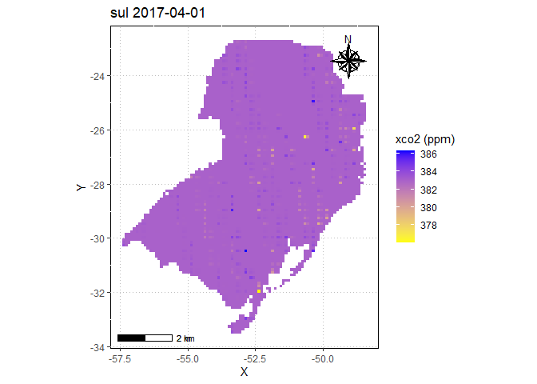

<!-- README.md is generated from README.Rmd. Please edit that file -->

# Projeto Final - R4DS2

### Aluno: Alan R. Panosso

### Data: 01/05/2021

<!-- badges: start -->
<!-- badges: end -->

A caracterização da concentração de CO<sub>2</sub> e sua variabilidade
espaço-temporal é fundamental para o planejamento e execução de medidas
com o propósito de mitigar as emissões de gases de efeito estufa.

O satélite OCO-2 foi lançado em órbita em julho de 2014 pela NASA, e
oferece um grande potencial nas estimativas dos fluxos de dióxido de
carbono (CO<sub>2</sub>). O satélite mede a concentração de
CO<sub>2</sub> atmosférico indiretamente por meio da intensidade da
radiação solar refletida em função da presença de dióxido de carbono em
uma coluna de ar. Desta forma, faz-se a leitura em três faixas de
comprimento de onda: a do O<sub>2</sub>, na faixa de 0,757 a 0,775 μm, e
as do CO<sub>2</sub>, que são subdividas em banda fraca (1,594 – 1,627
μm) e banda forte (2,043 – 2,087 μm).

Ele foi o primeiro satélite da NASA direcionado para o monitoramento dos
fluxos de CO<sub>2</sub> atmosférico, sendo um dos mais recentes, e vem
apresentando usos bem diversificados, mostrando-se capaz de monitorar as
emissões de combustíveis fósseis, fotossíntese, e produção de biomassa.

O objetivo desse material é apresentar os procedimentos básicos para
aquisição de dados do satélite OCO-2 e processamento inicial em R, para
tratamento, faxina, retirada de tendência e construção de mapas de
variabilidade espacial utilizando a variável concentração de dióxido de
carbono na coluna atmosférica (`xco2`). As análises serão realizadas
para as diferentes regiões do Brasil no período de 2014 a 2020, perído
total de dados disponibilizado pela Agencia Espacial Americana (National
Aeronautics and Space Administration - NASA).

# CO2 Virtual Science Data Environment

## Aquisição de dados

**1)** Acesse o endereço <https://co2.jpl.nasa.gov/>


**2)** Acesse o Browse *OCO-2 Data* em *Level 2 Data Set OCO-2*.


**3)** Role a página para baixo e acesse *CUSTOMIZE PRODUCT ON BUILD
PAGE*.


**4)** No menu à esquerda estarão as 9 categorias para personalizar o
banco de dados.


**5)** Em *DATA TYPE* selecione **OCO-2 Satellite**.


**6)** Em *PRODUCTS* selecione **OCO-2 Full**.


**7)** Em *DATA VERSION* selecione **10**.


**8)** Em *SPATIAL + TEMPORAL* selecione **Customize Your Spatial +
Temporal Coverage**.


**OPTION 01** Utilize para selecionar a área para aquisição dos dados.


**OPTION 02** Utilize para selecionar o período para aquisição dos
dados.


**9)** Em *DOWN SAMPLE PRODUCT* selecione **Yes, I want a Level 3 data
product**. Altere os valores das células e o passo temporal desejado.


**10)** Em *DATA VARIABLES* selecione as variáveis desejadas.


**11)** Abaixo são apresentadas as opções para os filtros e o tipo de
arquivo, selecione **CSV FILE**.


**12)** Forneça um endereço de e-mail para onde os links serão
direcionados.


**13)** Acesse o seu e-mail, será enviado uma mensagem com o endereço
dos arquivos onde você poderá acompanhar o progresso do processamento de
seus dados. Ao final dessa etapa uma nova mensagem será enviada
informando que os dados estão disponíveis.


**14)** Acesse o link enviado em seu e-mail e você será direcionado a
página.


**15)** Role a página para baixo e selecione a opção **WGET File List**.


**16)** Salve o arquivo `.txt` na pasta `data-raw`.


**17)** O arquivo contém os endereços de cada arquivo para download.


## Download dos arquivos

O código abaixo será utilizado para fazer o download dos arquivos CSV
com os dados do satélite OCO2.

``` r
# Definindo o Pipe e funções
source("r/graficos.R")
source("r/funcoes.R")

# Links de download gerados pela NASA
links <- list.files(path = "data-raw/",
             pattern = ".txt",
             full.names = TRUE) |>
    readr::read_table(col_names = FALSE,
                      col_types = "c") |>
    dplyr::pull(X1)

# Definindo os caminhos e nomes dos arquivos
n_split <- lengths(stringr::str_split(links[1],"/"))
files_csv <- stringr::str_split(links,"/",simplify = TRUE)[,n_split]
files_csv <- paste0("data-raw/csv/",files_csv)

# Definindo o plano de multisession
future::plan("multisession")

# Criando a função para fazer o download dos arquivos
download_arquivos <- function(url, dir){
  download.file(url, dir, mode = "wb")
  return(dir)
}
tictoc::tic()
purrr::map2(links[1:1], files_csv[1:1], 
            purrr::possibly(download_arquivos, ""))
#> Warning in download.file(url, dir, mode = "wb"): URL
#> 'http://co2web.jpl.nasa.gov/wpsoutput/20210216_052223.726060/OCO2L2Stdv10_L3_20140905_000000_20140930_235959.csv':
#> Timeout of 60 seconds was reached
#> [[1]]
#> [1] ""
tictoc::toc()
#> 24.27 sec elapsed
```

``` r
# Criando a função maybe_
maybe_download_nasa_prog <- function(url, dir, prog){
  prog()
  f <- purrr::possibly(download_arquivos, "")
  f(url, dir)
}

# Rodando com a barra de progresso
progressr::with_progress({
  prog <- progressr::progressor(along = links)
  furrr::future_map2(links, files_csv, 
                     maybe_download_nasa_prog, prog=prog)
})
```

Imagem dos arquivos baixados. Observe o tamanho dos arquivo individuais,
ao redor de *162 MB*.


## Faxina dos dados

O volume de dados é alto, ao todo os arquivos somam *11 GB*, então para
garantir a reprodutibilidade desse material, vamos realizar uma faxina
prévia dos dados, retirando os valores perdidos (falhas do sensor) que
foram registrados como **-999999.0**.


O código abaixo realiza a faxina inicial dos dados, após sua execussão o
volume de dados diminuiu consideravelmente, ao todo *63 MB*, como
apresentado na imagem subsequente.

``` r
faxina_co2 <- function(arquivo, col, valor_perdido){
   da <- readr::read_csv(arquivo) |>
     janitor::clean_names() |> 
     dplyr::filter({{col}} != valor_perdido)
   readr::write_csv(da,arquivo)
}

purrr::map(files_csv, faxina_co2,
           col=xco2_moles_mole_1,
           valor_perdido= -999999)
```


Agora vamos compilar todos os arquivos em um único que posteriormente
será salvo no diretório *data/oco2.rds*.

``` r
oco2 <- purrr::map_dfr(files_csv, ~readr::read_csv(.x))
readr::write_rds(oco2,"data/oco2.rds")
```

Abaixo observamos o vislumbre da base de dados, e algumas transformações
serão necessárias.

``` r
dplyr::glimpse(oco2)
#> Rows: 364,529
#> Columns: 11
#> $ longitude                              <dbl> -74.58225, -74.58225, -74.58225…
#> $ longitude_bnds                         <chr> "-74.70703125:-74.4574652778", …
#> $ latitude                               <dbl> -30.22572489, -29.97654828, -29…
#> $ latitude_bnds                          <chr> "-30.3503131952:-30.1011365845"…
#> $ time_yyyymmddhhmmss                    <dbl> 2.014091e+13, 2.014091e+13, 2.0…
#> $ time_bnds_yyyymmddhhmmss               <chr> "20140909000000:20140910000000"…
#> $ altitude_km                            <dbl> 3307.8, 3307.8, 3307.8, 3307.8,…
#> $ alt_bnds_km                            <chr> "0.0:6615.59960938", "0.0:6615.…
#> $ fluorescence_offset_relative_771nm_idp <dbl> 0.012406800, 0.010696600, -0.00…
#> $ fluorescence_offset_relative_757nm_idp <dbl> -3.58630e+00, 8.81219e-02, -3.6…
#> $ xco2_moles_mole_1                      <dbl> 0.000394333, 0.000395080, 0.000…
```

Inicialmente devemos transformar os dados de concentração de CO2,
variável `xco2_moles_mole_1` para ppm em seguida devemos criar as
variáveis de data a partir da variável `time_yyyymmddhhmmss`.

``` r
oco2<-oco2 |>
         dplyr::mutate(
           xco2 = xco2_moles_mole_1*1e06,
           data = lubridate::ymd_hms(time_yyyymmddhhmmss),
           ano = lubridate::year(data),
           mes = lubridate::month(data),
           dia = lubridate::day(data),
           dia_semana = lubridate::wday(data))
```

Existe uma tendência de aumento monotônica mundial da concentração de
CO2 na atmosfera, assim, ela deve ser retirada para podermos observar as
tendências regionais.

``` r
oco2 |> 
  ggplot2::ggplot(ggplot2::aes(x=data,y=xco2)) +
  ggplot2::geom_point(color="blue") +
  ggplot2::geom_line(color="red")
```

<!-- -->

Agora devemos retirar a tendência ao longo do tempo, para isso, dentro
do período específico, faremos a retirada por meio de um ajuste linear:

``` r
oco2 |> 
  dplyr::arrange(data) |>
  dplyr::mutate(x= 1:nrow(oco2)) |> 
  ggplot2::ggplot(ggplot2::aes(x=x,y=xco2)) +
  ggplot2::geom_point(shape=21,color="black",fill="gray") +
  ggplot2::geom_smooth(method = "lm") +
  ggpubr::stat_regline_equation(ggplot2::aes(
  label =  paste(..eq.label.., ..rr.label.., sep = "*plain(\",\")~~")))
#> Warning: The dot-dot notation (`..eq.label..`) was deprecated in ggplot2 3.4.0.
#> ℹ Please use `after_stat(eq.label)` instead.
#> This warning is displayed once every 8 hours.
#> Call `lifecycle::last_lifecycle_warnings()` to see where this warning was
#> generated.
#> `geom_smooth()` using formula = 'y ~ x'
```

<!-- -->

Extrair os coeficientes a e b da análise de regressão linear (y=a+bX).

``` r
d_aux<-oco2 |> 
  dplyr::arrange(data) |>
  dplyr::mutate(x= 1:nrow(oco2)) |>                  
  dplyr::select(x,xco2)
mod <- lm(d_aux$xco2~d_aux$x)
summary.lm(mod)
#> 
#> Call:
#> lm(formula = d_aux$xco2 ~ d_aux$x)
#> 
#> Residuals:
#>     Min      1Q  Median      3Q     Max 
#> -80.677  -1.278   0.585   2.050  74.232 
#> 
#> Coefficients:
#>              Estimate Std. Error t value Pr(>|t|)    
#> (Intercept) 3.928e+02  1.216e-02 32302.8   <2e-16 ***
#> d_aux$x     4.437e-05  5.778e-08   767.8   <2e-16 ***
#> ---
#> Signif. codes:  0 '***' 0.001 '**' 0.01 '*' 0.05 '.' 0.1 ' ' 1
#> 
#> Residual standard error: 3.671 on 364527 degrees of freedom
#> Multiple R-squared:  0.6179, Adjusted R-squared:  0.6179 
#> F-statistic: 5.895e+05 on 1 and 364527 DF,  p-value: < 2.2e-16
a<-mod$coefficients[1]
b<-mod$coefficients[2]
```

Criando a variável xco2_est a partir da retirada da tendência.

``` r
oco2 <- oco2 |> 
  dplyr::arrange(data) |>
  dplyr::mutate(
    x= 1:nrow(oco2),
    xco2_est = a + b * x,
    delta = xco2_est - xco2,
    XCO2 = (a-delta) - (mean(xco2) - a)
  ) 
dplyr::glimpse(oco2)
#> Rows: 364,529
#> Columns: 21
#> $ longitude                              <dbl> -72.58572, -72.33615, -72.33615…
#> $ longitude_bnds                         <chr> "-72.7105034722:-72.4609375", "…
#> $ latitude                               <dbl> 6.154060, 5.157354, 5.406530, 3…
#> $ latitude_bnds                          <chr> "6.02947197682:6.27864858759", …
#> $ time_yyyymmddhhmmss                    <dbl> 2.014091e+13, 2.014091e+13, 2.0…
#> $ time_bnds_yyyymmddhhmmss               <chr> "20140906000000:20140907000000"…
#> $ altitude_km                            <dbl> 3307.8, 3307.8, 3307.8, 3307.8,…
#> $ alt_bnds_km                            <chr> "0.0:6615.59960938", "0.0:6615.…
#> $ fluorescence_offset_relative_771nm_idp <dbl> 0.01034260, 0.01597090, 0.00988…
#> $ fluorescence_offset_relative_757nm_idp <dbl> 0.00158627, 0.00160726, 0.00848…
#> $ xco2_moles_mole_1                      <dbl> 0.000391368, 0.000389822, 0.000…
#> $ xco2                                   <dbl> 391.368, 389.822, 388.482, 390.…
#> $ data                                   <dttm> 2014-09-06 12:00:00, 2014-09-0…
#> $ ano                                    <dbl> 2014, 2014, 2014, 2014, 2014, 2…
#> $ mes                                    <dbl> 9, 9, 9, 9, 9, 9, 9, 9, 9, 9, 9…
#> $ dia                                    <int> 6, 6, 6, 6, 6, 6, 6, 6, 6, 6, 6…
#> $ dia_semana                             <dbl> 7, 7, 7, 7, 7, 7, 7, 7, 7, 7, 7…
#> $ x                                      <int> 1, 2, 3, 4, 5, 6, 7, 8, 9, 10, …
#> $ xco2_est                               <dbl> 392.8449, 392.8450, 392.8450, 3…
#> $ delta                                  <dbl> 1.4769085, 3.0229529, 4.3629972…
#> $ XCO2                                   <dbl> 383.2815, 381.7354, 380.3954, 3…
```

Visualização da concentração de CO2 no ano de 2014, primeiro ano de
utilização do satélite.

``` r
oco2 |>
  dplyr::filter(ano == 2014) |>
  ggplot2::ggplot(ggplot2::aes(x=longitude, y=latitude, color=dia_semana)) +
  ggplot2::geom_point()
```

<!-- -->

A próxima operação é selecionarmos na base de dados somente os pontos
pertencentes ao território brasileiro. Assim vamos utilizar o pacote
`geobr` para criarmos o filtro a partir do polígono do Brasil e regiões.

``` r
regiao <- geobr::read_region(showProgress = FALSE)
#> Loading required namespace: sf
#> Using year 2010
br <- geobr::read_country(showProgress = FALSE)
#> Using year 2010
```

Agora podemos extrair os polígonos

``` r
### Polígono Brasil
pol_br <- br$geom |> purrr::pluck(1) |> as.matrix()

### Polígonos das Regiões
pol_norte <- regiao$geom |> purrr::pluck(1) |> as.matrix()
pol_nordeste <- regiao$geom |> purrr::pluck(2) |> as.matrix()
pol_sudeste <- regiao$geom |> purrr::pluck(3) |> as.matrix()
pol_sul <- regiao$geom |> purrr::pluck(4) |> as.matrix()
pol_centroeste<- regiao$geom |> purrr::pluck(5) |> as.matrix()
```

Plot dos pontos e o polígono

``` r
br |>
  ggplot2::ggplot() +
  ggplot2::geom_sf(fill="#2D3E50", color="#FEBF57",
          size=.15, show.legend = FALSE)+
  tema_mapa() +
  ggplot2::geom_point(data=oco2 |> dplyr::filter(ano == 2014) ,
             ggplot2::aes(x=longitude,y=latitude),
             shape=3,
             col="red",
             alpha=0.2)
```

<!-- -->

A partir da função `point.in.pol()` do pacote `{sp}`, criamos a função
abaixo para facilitar o processo de filtragem em função de um polígono
definido.

``` r
#' @title Define se pontos pertencem a um polígono
#'
#' @name def_pol
#'
#' @description Verifica para um ou mais pontos se eles se enquadram em um determinado polígono.
#'
#' @param x Vetor com a coordenada x do ponto
#' @param y Vetor com a coordenada y do ponto
#' @param pol matriz do polígono
#'
#'
#' @details Função baseada na função point.in.pol do pacote sp, utilziada
#'  para filtrar os pontos pertencentes aos polígonos dos estados, 
#'   regiões e muicípios do Brasil.

def_pol <- function(x, y, pol){
  as.logical(sp::point.in.polygon(point.x = x,
                                  point.y = y,
                                  pol.x = pol[,1],
                                  pol.y = pol[,2]))
}
```

Vamos criar o filtro para os pontos pertencentes ao polígono do Brasil e
demais regiões.

``` r
oco2 <- oco2 |>
          dplyr::mutate(
            flag_br = def_pol(longitude, latitude, pol_br),
            flag_norte = def_pol(longitude, latitude, pol_norte),
            flag_nordeste = def_pol(longitude, latitude, pol_nordeste),
            flag_sul = def_pol(longitude, latitude, pol_sul),
            flag_sudeste = def_pol(longitude, latitude, pol_sudeste),
            flag_centroeste = def_pol(longitude, latitude, pol_centroeste)
          ) 
#> The legacy packages maptools, rgdal, and rgeos, underpinning the sp package,
#> which was just loaded, will retire in October 2023.
#> Please refer to R-spatial evolution reports for details, especially
#> https://r-spatial.org/r/2023/05/15/evolution4.html.
#> It may be desirable to make the sf package available;
#> package maintainers should consider adding sf to Suggests:.
#> The sp package is now running under evolution status 2
#>      (status 2 uses the sf package in place of rgdal)
dplyr::glimpse(oco2)
#> Rows: 364,529
#> Columns: 27
#> $ longitude                              <dbl> -72.58572, -72.33615, -72.33615…
#> $ longitude_bnds                         <chr> "-72.7105034722:-72.4609375", "…
#> $ latitude                               <dbl> 6.154060, 5.157354, 5.406530, 3…
#> $ latitude_bnds                          <chr> "6.02947197682:6.27864858759", …
#> $ time_yyyymmddhhmmss                    <dbl> 2.014091e+13, 2.014091e+13, 2.0…
#> $ time_bnds_yyyymmddhhmmss               <chr> "20140906000000:20140907000000"…
#> $ altitude_km                            <dbl> 3307.8, 3307.8, 3307.8, 3307.8,…
#> $ alt_bnds_km                            <chr> "0.0:6615.59960938", "0.0:6615.…
#> $ fluorescence_offset_relative_771nm_idp <dbl> 0.01034260, 0.01597090, 0.00988…
#> $ fluorescence_offset_relative_757nm_idp <dbl> 0.00158627, 0.00160726, 0.00848…
#> $ xco2_moles_mole_1                      <dbl> 0.000391368, 0.000389822, 0.000…
#> $ xco2                                   <dbl> 391.368, 389.822, 388.482, 390.…
#> $ data                                   <dttm> 2014-09-06 12:00:00, 2014-09-0…
#> $ ano                                    <dbl> 2014, 2014, 2014, 2014, 2014, 2…
#> $ mes                                    <dbl> 9, 9, 9, 9, 9, 9, 9, 9, 9, 9, 9…
#> $ dia                                    <int> 6, 6, 6, 6, 6, 6, 6, 6, 6, 6, 6…
#> $ dia_semana                             <dbl> 7, 7, 7, 7, 7, 7, 7, 7, 7, 7, 7…
#> $ x                                      <int> 1, 2, 3, 4, 5, 6, 7, 8, 9, 10, …
#> $ xco2_est                               <dbl> 392.8449, 392.8450, 392.8450, 3…
#> $ delta                                  <dbl> 1.4769085, 3.0229529, 4.3629972…
#> $ XCO2                                   <dbl> 383.2815, 381.7354, 380.3954, 3…
#> $ flag_br                                <lgl> FALSE, FALSE, FALSE, FALSE, FAL…
#> $ flag_norte                             <lgl> FALSE, FALSE, FALSE, FALSE, FAL…
#> $ flag_nordeste                          <lgl> FALSE, FALSE, FALSE, FALSE, FAL…
#> $ flag_sul                               <lgl> FALSE, FALSE, FALSE, FALSE, FAL…
#> $ flag_sudeste                           <lgl> FALSE, FALSE, FALSE, FALSE, FAL…
#> $ flag_centroeste                        <lgl> FALSE, FALSE, FALSE, FALSE, FAL…
```

Plot dos pontos do polígono pol_br.

``` r
br |>
  ggplot2::ggplot() +
  ggplot2::geom_sf(fill="#2D3E50", color="#FEBF57",
          size=.15, show.legend = FALSE)+
  tema_mapa() +
  ggplot2::geom_point(data=oco2 |> dplyr::filter(flag_br, ano == 2014) ,
             ggplot2::aes(x=longitude,y=latitude),
             shape=3,
             col="red",
             alpha=0.2)
```

<!-- -->

Observe que houve uma falha na região nordeste, podemos então pedir os
pontos presentes do polígono br ou nordeste.

``` r
br |>
  ggplot2::ggplot() +
  ggplot2::geom_sf(fill="#2D3E50", color="#FEBF57",
          size=.15, show.legend = FALSE)+
  tema_mapa() +
  ggplot2::geom_point(data=oco2 |> 
                      dplyr::filter(flag_br|flag_nordeste, ano == 2014),
             ggplot2::aes(x=longitude,y=latitude),
             shape=3,
             col="red",
             alpha=0.2)
```

<!-- -->

A falha continuou, então vamos corrigir o polígono da Brasil e da região
nordeste.

``` r
# Retirando alguns pontos
pol_br <- pol_br[pol_br[,1]<=-34,]
pol_br <- pol_br[!((pol_br[,1]>=-38.8 & pol_br[,1]<=-38.6) &
                              (pol_br[,2]>= -19 & pol_br[,2]<= -16)),]

pol_nordeste <- pol_nordeste[pol_nordeste[,1]<=-34,]
pol_nordeste <- pol_nordeste[!((pol_nordeste[,1]>=-38.7 & pol_nordeste[,1]<=-38.6) & pol_nordeste[,2]<= -15),]


# Recriando o flag_nordeste
oco2 <- oco2 |>
          dplyr::mutate(
            flag_br = def_pol(longitude, latitude, pol_br),
            flag_nordeste = def_pol(longitude, latitude, pol_nordeste)
            )

# Plot do mapa e os pontos
br |>
  ggplot2::ggplot() +
  ggplot2::geom_sf(fill="#2D3E50", color="#FEBF57",
          size=.15, show.legend = FALSE)+
  tema_mapa() +
  ggplot2::geom_point(data=oco2 |> 
                      dplyr::filter(flag_br|flag_nordeste, ano == 2014),
             ggplot2::aes(x=longitude,y=latitude),
             shape=3,
             col="red",
             alpha=0.2)
```

<!-- -->

Agora podemos filtrar os pontos para o território brasileiro e salvar o
arquivo no diretório **data/oco2_br.rds**.

``` r
oco2_br <- oco2 |>
  dplyr::filter( flag_br | flag_nordeste ) |>
  dplyr::select(-flag_br)
readr::write_rds(oco2_br,"data/oco2_br.rds")
```

## Análise de série espaço-temporal

Serão as concentrações de CO2 na regição Norte onde se encontra o bioma
Amazônico diferente daquele observado nas demais regiões?

``` r
oco2_br |> 
    tidyr::pivot_longer(
    dplyr::starts_with("flag"),
    names_to = "região",
    values_to = "flag"
  ) |> 
  dplyr::filter(flag) |> 
  dplyr::mutate(região = stringr::str_remove(região,"flag_")) |> 
  dplyr::group_by(região, ano, mes) |> 
  dplyr::summarise(media_co2 = mean(XCO2, na.rm=TRUE)) |> 
    dplyr::mutate(
    mes_ano = lubridate::make_date(ano, mes, 1)
  ) |> 
  ggplot2::ggplot(ggplot2::aes(x = mes_ano, y = media_co2,
                               color=região)) +
  ggplot2::geom_line() +
  ggplot2::theme_bw()
```

<!-- --> A região
Norte apresenta uma menor sazonalidade com as menores variações da
concentração de CO2 atmosférico quando comparada às demais regiões.

Vamos criar a coluna região para identicação dos pontos. Além disso será
criado a coluna mes_ano.

``` r
oco2_br |> 
    tidyr::pivot_longer(
    dplyr::starts_with("flag"),
    names_to = "região",
    values_to = "flag"
  ) |> 
  dplyr::filter(flag) |> 
  dplyr::mutate(região = stringr::str_remove(região,"flag_")) |> 
  dplyr::group_by(região, ano, mes) |> 
  dplyr::summarise(media_co2 = mean(XCO2, na.rm=TRUE)) |> 
    dplyr::mutate(
    mes_ano = lubridate::make_date(ano, mes, 1)
  )
#> # A tibble: 365 × 5
#> # Groups:   região, ano [35]
#>    região       ano   mes media_co2 mes_ano   
#>    <chr>      <dbl> <dbl>     <dbl> <date>    
#>  1 centroeste  2014     9      386. 2014-09-01
#>  2 centroeste  2014    10      386. 2014-10-01
#>  3 centroeste  2014    11      385. 2014-11-01
#>  4 centroeste  2014    12      382. 2014-12-01
#>  5 centroeste  2015     1      383. 2015-01-01
#>  6 centroeste  2015     2      383. 2015-02-01
#>  7 centroeste  2015     3      382. 2015-03-01
#>  8 centroeste  2015     4      382. 2015-04-01
#>  9 centroeste  2015     5      384. 2015-05-01
#> 10 centroeste  2015     6      386. 2015-06-01
#> # ℹ 355 more rows
```

## Análise de variabilidade espaço-temporal para os pontos da região norte.

``` r
xco2_norte <- oco2_br |> 
  dplyr::filter(flag_norte, ano==2014) |> 
  dplyr::mutate(coordxy = paste0(latitude,longitude)) |> 
  dplyr::group_by(longitude,latitude) |> 
  dplyr::summarise(xco2_media = mean(XCO2, na.rm=TRUE) )

xco2_norte |> 
  ggplot2::ggplot(ggplot2::aes(x=longitude, y=latitude) ) + 
  ggplot2::geom_point()
```

<!-- -->

De posse desse mapa, vamos fazer a análise de dependência espacial.
Definindo os valores de X e Y e a fórmula para análise variográfica.

``` r
sp::coordinates(xco2_norte)=~ longitude+latitude  
form<-xco2_media~1 # fórmula para ser utilizado na função variogram
```

Verificando o Variograma experimental

``` r
vari_co2_norte<-gstat::variogram(form, data=xco2_norte)
vari_co2_norte |> 
  ggplot2::ggplot(ggplot2::aes(x=dist, y=gamma)) +
  ggplot2::geom_point()
```

<!-- -->

## Modelagem espaço-temporal

Vamos ajustar um modela esférico ao variograma experimental anterior.

``` r
m_xco2 <- gstat::fit.variogram(vari_co2_norte,gstat::vgm(1,"Sph",10,0))
plot(vari_co2_norte,model=m_xco2, col=1,pl=F,pch=16)
```

<!-- -->

Vamos criar o grid refinado para a interpolação

``` r
x<-xco2_norte$longitude
y<-xco2_norte$latitude
dis <- 0.1 #Distância entre pontos
grid <- expand.grid(X=seq(min(x),max(x),dis), Y=seq(min(y),max(y),dis))
sp::gridded(grid) = ~ X + Y
```

Krigragem ordinária (KO)

Utilizando o algorítmo de KO, vamos estimar xco2 nos locais não
amostrados.

``` r
ko_fco2<-gstat::krige(formula=form, xco2_norte, grid, model=m_xco2, 
    block=c(0,0),
    nsim=0,
    na.action=na.pass,
    debug.level=-1,  
    )
#> [using ordinary kriging]
#>   0% done  1% done  2% done  4% done  5% done  7% done  8% done 10% done 11% done 13% done 14% done 15% done 16% done 18% done 19% done 21% done 22% done 24% done 25% done 27% done 28% done 29% done 30% done 32% done 33% done 35% done 36% done 38% done 39% done 40% done 41% done 43% done 44% done 45% done 46% done 47% done 48% done 50% done 51% done 53% done 54% done 55% done 57% done 58% done 59% done 60% done 62% done 63% done 64% done 65% done 67% done 68% done 69% done 71% done 72% done 74% done 75% done 76% done 78% done 79% done 80% done 82% done 83% done 85% done 86% done 88% done 89% done 91% done 92% done 94% done 95% done 96% done 98% done 99% done100% done
```

Mapa de padrões espaciais para o Ano de 2014 da região Norte.

``` r
tibble::as.tibble(ko_fco2) |> 
  ggplot2::ggplot(ggplot2::aes(x=X, y=Y)) + 
  ggplot2::geom_tile(ggplot2::aes(fill = var1.pred)) +
  ggplot2::scale_fill_gradient(low = "yellow", high = "blue") + 
  ggplot2::coord_equal()
#> Warning: `as.tibble()` was deprecated in tibble 2.0.0.
#> ℹ Please use `as_tibble()` instead.
#> ℹ The signature and semantics have changed, see `?as_tibble`.
#> This warning is displayed once every 8 hours.
#> Call `lifecycle::last_lifecycle_warnings()` to see where this warning was
#> generated.
```

<!-- -->

Mapa do padrão espacial com o contorno.

``` r
tibble::as.tibble(ko_fco2) |> 
  dplyr::mutate(flag_norte = def_pol(X,Y,pol_norte)) |> 
  dplyr::filter(flag_norte) |> 
  ggplot2::ggplot(ggplot2::aes(x=X, y=Y),color="black") + 
  ggplot2::geom_tile(ggplot2::aes(fill = var1.pred)) +
  ggplot2::scale_fill_gradient(low = "yellow", high = "blue") + 
  ggplot2::coord_equal()+
  tema_mapa()+
  ggplot2::labs(fill="xco2 (ppm)") +
  ggspatial::annotation_scale(
    location="bl",
    plot_unit="km",
    height = ggplot2::unit(0.2,"cm"))
```

<!-- -->

## Motivação Final

### Criar para cada região o mapa de interpolação via krigagem ordinária por região ao longo dos trimestres dos anos de 2014 a 2020.

``` r
oco2_nest<-oco2_br |> 
  dplyr::mutate(trimestre = lubridate::quarter(data)) |> 
  tidyr::pivot_longer(
    starts_with("flag"),
    names_to = "região",
    values_to = "flag"
  ) |> 
  dplyr::filter(flag) |> 
  dplyr::mutate(região = stringr::str_remove(região,"flag_")) |> 
  dplyr::group_by(longitude, latitude, região, ano, trimestre) |> 
  dplyr::summarise(media_co2 = mean(XCO2, na.rm=TRUE)) |> 
    dplyr::mutate(
    trimestre_ano = lubridate::make_date(ano, trimestre, 1),
    regi = região,
    id_time = trimestre_ano
  ) |> 
  dplyr::group_by(região,trimestre_ano) |> 
  tidyr::nest() 
head(oco2_nest)
#> # A tibble: 6 × 3
#> # Groups:   região, trimestre_ano [6]
#>   região trimestre_ano data                
#>   <chr>  <date>        <list>              
#> 1 norte  2017-03-01    <tibble [1,476 × 7]>
#> 2 norte  2020-03-01    <tibble [1,637 × 7]>
#> 3 norte  2015-04-01    <tibble [829 × 7]>  
#> 4 norte  2019-04-01    <tibble [798 × 7]>  
#> 5 norte  2014-04-01    <tibble [820 × 7]>  
#> 6 norte  2016-04-01    <tibble [899 × 7]>
```

Criaremos uma função para modelagem e krigagem como apresentado
anterioremente.

``` r
geoestati <- function(df,modelo="Sph"){
  #Variograma
  sp::coordinates(df)=~ longitude+latitude  
  form<-media_co2~1
  vari<-gstat::variogram(form, data=df)
  alpha <- max(vari$gamma)
  beta <- max(vari$dist)
  m_xco2 <- gstat::fit.variogram(vari,gstat::vgm(0,modelo,beta,0))
  if(m_xco2$range[2] < 0 ) m_xco2 <- gstat::fit.variogram(vari,gstat::vgm(alpha,modelo,beta,0))
  
  # Adensamento de pontos
  x<-df$longitude
  y<-df$latitude
  dis <- 0.1 # usamos a malha padrão
  grid <- expand.grid(X=seq(min(x),max(x),dis), Y=seq(min(y),max(y),dis))
  sp::gridded(grid) = ~ X + Y

  #Krigagem ordinária
  ko_xco2<-gstat::krige(formula=form, df, grid, model=m_xco2,
    block=c(0,0),
    nsim=0,
    na.action=na.pass
  )

  # Definindo os polígonos - Dependência externa da função
  regiao <- df$regi[1]
  if(regiao == "norte") pol_ <- pol_norte
  if(regiao == "nordeste") pol_ <- pol_nordeste
  if(regiao == "sul") pol_ <- pol_sul
  if(regiao == "sudeste") pol_ <- pol_sudeste
  if(regiao == "centroeste") pol_ <- pol_centroeste


  # Saída do mapa krigado
   tibble::as.tibble(ko_xco2) |>
   dplyr::mutate(flag = def_pol(X,Y,pol_)) |>
   dplyr::filter(flag) |>
   ggplot2::ggplot(ggplot2::aes(x=X, y=Y)) +
   ggplot2::geom_tile(ggplot2::aes(fill = var1.pred)) +
   ggplot2::scale_fill_gradient(low = "yellow", high = "blue") +
   ggplot2::coord_equal()+
   tema_mapa()+
   ggplot2::labs(fill="xco2 (ppm)",
        title = paste(regiao,df$id_time[1]) ) +
   ggspatial::annotation_scale(
   location="bl",
   plot_unit="km",
   height = ggplot2::unit(0.2,"cm"))
}
```

Laço para criar os mapas por trimestre.

``` r
oco2_nest <- oco2_nest |> 
  dplyr::mutate( 
    geo_sph = purrr::map(data,geoestati,modelo="Sph")
    )
#> [using ordinary kriging]
#> [using ordinary kriging]
#> [using ordinary kriging]
#> [using ordinary kriging]
#> [using ordinary kriging]
#> [using ordinary kriging]
#> [using ordinary kriging]
#> [using ordinary kriging]
#> [using ordinary kriging]
#> [using ordinary kriging]
#> [using ordinary kriging]
#> [using ordinary kriging]
#> [using ordinary kriging]
#> [using ordinary kriging]
#> [using ordinary kriging]
#> [using ordinary kriging]
#> [using ordinary kriging]
#> [using ordinary kriging]
#> [using ordinary kriging]
#> [using ordinary kriging]
#> [using ordinary kriging]
#> [using ordinary kriging]
#> [using ordinary kriging]
#> [using ordinary kriging]
#> [using ordinary kriging]
#> [using ordinary kriging]
#> [using ordinary kriging]
#> [using ordinary kriging]
#> [using ordinary kriging]
#> [using ordinary kriging]
#> [using ordinary kriging]
#> [using ordinary kriging]
#> [using ordinary kriging]
#> [using ordinary kriging]
#> [using ordinary kriging]
#> [using ordinary kriging]
#> [using ordinary kriging]
#> [using ordinary kriging]
#> [using ordinary kriging]
#> [using ordinary kriging]
#> [using ordinary kriging]
#> [using ordinary kriging]
#> [using ordinary kriging]
#> [using ordinary kriging]
#> [using ordinary kriging]
#> [using ordinary kriging]
#> [using ordinary kriging]
#> [using ordinary kriging]
#> [using ordinary kriging]
#> [using ordinary kriging]
#> [using ordinary kriging]
#> [using ordinary kriging]
#> [using ordinary kriging]
#> [using ordinary kriging]
#> [using ordinary kriging]
#> [using ordinary kriging]
#> [using ordinary kriging]
#> [using ordinary kriging]
#> [using ordinary kriging]
#> [using ordinary kriging]
#> [using ordinary kriging]
#> [using ordinary kriging]
#> [using ordinary kriging]
#> [using ordinary kriging]
#> [using ordinary kriging]
#> [using ordinary kriging]
#> [using ordinary kriging]
#> [using ordinary kriging]
#> [using ordinary kriging]
#> [using ordinary kriging]
#> [using ordinary kriging]
#> [using ordinary kriging]
#> [using ordinary kriging]
#> [using ordinary kriging]
#> [using ordinary kriging]
#> [using ordinary kriging]
#> [using ordinary kriging]
#> [using ordinary kriging]
#> [using ordinary kriging]
#> [using ordinary kriging]
#> [using ordinary kriging]
#> [using ordinary kriging]
#> [using ordinary kriging]
#> [using ordinary kriging]
#> [using ordinary kriging]
#> [using ordinary kriging]
#> [using ordinary kriging]
#> [using ordinary kriging]
#> [using ordinary kriging]
#> [using ordinary kriging]
#> [using ordinary kriging]
#> [using ordinary kriging]
#> [using ordinary kriging]
#> [using ordinary kriging]
#> [using ordinary kriging]
#> [using ordinary kriging]
#> [using ordinary kriging]
#> [using ordinary kriging]
#> [using ordinary kriging]
#> [using ordinary kriging]
#> [using ordinary kriging]
#> [using ordinary kriging]
#> [using ordinary kriging]
#> [using ordinary kriging]
#> [using ordinary kriging]
#> [using ordinary kriging]
#> [using ordinary kriging]
#> [using ordinary kriging]
#> [using ordinary kriging]
#> [using ordinary kriging]
#> [using ordinary kriging]
#> [using ordinary kriging]
#> [using ordinary kriging]
#> [using ordinary kriging]
#> [using ordinary kriging]
#> [using ordinary kriging]
#> [using ordinary kriging]
#> [using ordinary kriging]
#> [using ordinary kriging]
#> [using ordinary kriging]
#> [using ordinary kriging]
#> [using ordinary kriging]
#> [using ordinary kriging]
#> [using ordinary kriging]
#> [using ordinary kriging]
#> [using ordinary kriging]
#> [using ordinary kriging]
#> [using ordinary kriging]
#> [using ordinary kriging]
#> [using ordinary kriging]
dplyr::glimpse(oco2_nest)
#> Rows: 130
#> Columns: 4
#> Groups: região, trimestre_ano [130]
#> $ região        <chr> "norte", "norte", "norte", "norte", "norte", "norte", "n…
#> $ trimestre_ano <date> 2017-03-01, 2020-03-01, 2015-04-01, 2019-04-01, 2014-04…
#> $ data          <list> [<tbl_df[1476 x 7]>], [<tbl_df[1637 x 7]>], [<tbl_df[82…
#> $ geo_sph       <list> [-61.83355035, -61.53355035, -61.43355035, -60.93355035…
```

Vamos verificar alguns mapas.

``` r
print(oco2_nest$geo_sph[1])
#> [[1]]
#> Using plotunit = 'm'
```

<!-- -->

``` r
print(oco2_nest$geo_sph[20])
#> [[1]]
#> Using plotunit = 'm'
```

<!-- -->

``` r
print(oco2_nest$geo_sph[30])
#> [[1]]
#> Using plotunit = 'm'
```

<!-- -->

``` r
print(oco2_nest$geo_sph[60])
#> [[1]]
#> Using plotunit = 'm'
```

<!-- -->

``` r
print(oco2_nest$geo_sph[80])
#> [[1]]
#> Using plotunit = 'm'
```

<!-- -->

``` r
print(oco2_nest$geo_sph[120])
#> [[1]]
#> Using plotunit = 'm'
```

<!-- -->
