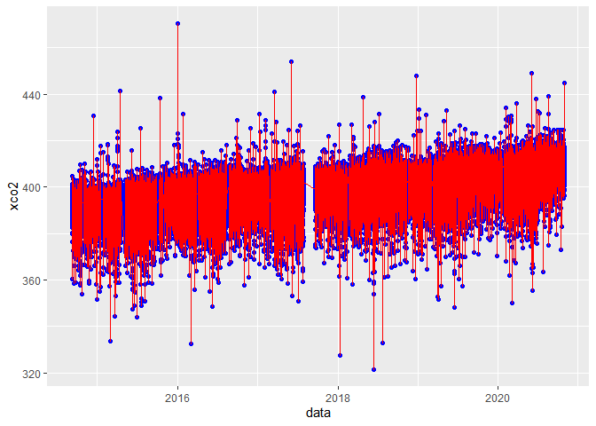
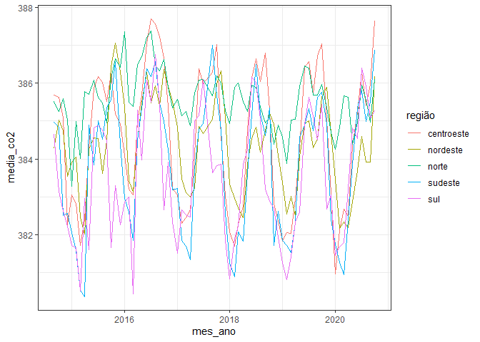
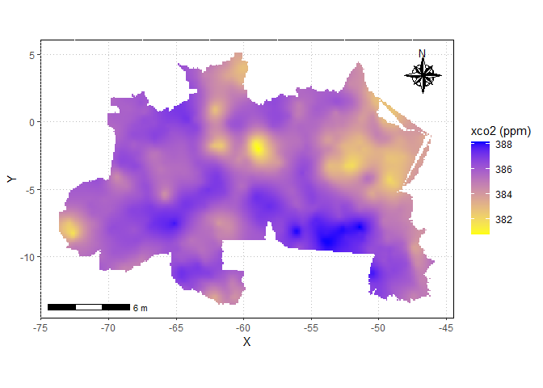
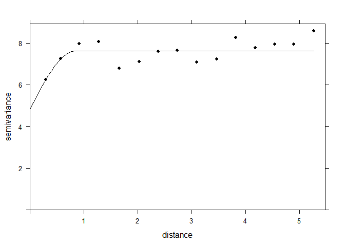

<!-- README.md is generated from README.Rmd. Please edit that file -->

# Projeto Final - R4DS2

### Aluno: Alan R. Panosso

### Data: 01/05/2021

<!-- badges: start -->
<!-- badges: end -->

# CO2 Virtual Science Data Environment

O objetivo desse material é apresentar os procedimentos básicos para
aquisição de dados do satélite OCO-2 e processamento inicial em R.

## Aquisição de dados

**1)** Acesse o endereço <https://co2.jpl.nasa.gov/>


**2)** Acesse o Browse *OCO-2 Data* em *Level 2 Data Set OCO-2*.


**3)** Role a página para baixo e acesse *CUSTOMIZE PRODUCT ON BUILD
PAGE*.


**4)** No menu à esquerda estarão as 9 categorias para personalizar o
banco de dados.


**5)** Em *DATA TYPE* selecione **OCO-2 Satellite**.


**6)** Em *PRODUCTS* selecione **OCO-2 Full**.


**7)** Em *DATA VERSION* selecione **10**.


**8)** Em *SPATIAL + TEMPORAL* selecione **Customize Your Spatial +
Temporal Coverage**.


**OPTION 01** Utilize para selecionar a área para aquisição dos dados.


**OPTION 02** Utilize para selecionar o período para aquisição dos
dados.


**9)** Em *DOWN SAMPLE PRODUCT* selecione **Yes, I want a Level 3 data
product**. Altere os valores das células e o passo temporal desejado.


**10)** Em *DATA VARIABLES* selecione as variáveis desejadas.


**11)** Abaixo são apresentadas as opções para os filtros e o tipo de
arquivo, selecione **CSV FILE**.


**12)** Forneça um endereço de e-mail para onde os links serão
direcionados.


**13)** Acesse o seu e-mail, será enviado uma mensagem com o endereço
dos arquivos onde você poderá acompanhar o progresso do processamento de
seus dados. Ao final dessa etapa um novo e-mail é enviado informando que
os dados estão disponíveis.


**14)** Acesse o link enviado em seu e-mail e você será direcionado a
página.


**15)** Role a página para baixo e selecione a opção **WGET File List**.


**16)** Salve o arquivo `.txt` na pasta `data-raw`.


**17)** O arquivo contém os endereços de cada arquivo para download.


## Download dos arquivos

O código abaixo será utilizado para fazer o download dos arquivos CSV
com os dados do satélite OCO2.

``` r
# Definindo o Pipe e funções
`%>%` <- magrittr::`%>%`
source("r/graficos.R")
source("r/funcoes.R")

# Links de download gerados pela NASA
links <- list.files(path = "data-raw/",
             pattern = ".txt",
             full.names = TRUE) %>%
    read.table() %>%
    dplyr::pull(V1)

# Definindo os caminhos e nomes dos arquivos
n_split <- lengths(stringr::str_split(links[1],"/"))
files.csv <- stringr::str_split(links,"/",simplify = TRUE)[,n_split]
files.csv <- paste0("data-raw/csv/",files.csv)

# Download dos arquivos .csv
# purrr::map2(links,
#             files.csv,
#             .f=download.file,mode="wb")
```

Imagem dos arquivos baixados. Observe o tamnho dos arquivo individuais,
ao redor de *162 MB*.


## Faxina dos dados

O volume de dados é alto, ao todo os arquivos somam *11 GB*, então para
garantir a reprodutibilidade desse material, vamos realizar uma faxina
prévia dos dados, retirando os valores perdidos (falhas do sensor) que
foram registrados como **-999999.0**.


O código abaixo realiza a faxina inicial dos dados, após sua execussão o
volume de dados diminuiu consideravelmente, ao todo *63 MB*, como
apresentado na imagem subsequente.

``` r
faxina_co2 <- function(arquivo, col, valor_perdido){
   da <- readr::read_csv(arquivo) %>%
     dplyr::filter({{col}} != valor_perdido)
   readr::write_csv(da,arquivo)
}

purrr::map(files.csv, faxina_co2,
           col=`xco2 (Moles Mole^{-1})`,
           valor_perdido= -999999)
```


Agora vamos compilar todos os arquivos em um único que posteriormente
será salvo no diretório *data/oco2.rds*.

``` r
oco2 <- purrr::map_dfr(files.csv, ~readr::read_csv(.x))
readr::write_rds(oco2,"data/oco2.rds")
```

Abaixo observamos o vislumbre da base de dados, e algumas transformações
serão necessárias.

``` r
dplyr::glimpse(oco2)
#> Rows: 364,529
#> Columns: 11
#> $ longitude                              <dbl> -74.58225, -74.58225, -74.58...
#> $ longitude_bnds                         <chr> "-74.70703125:-74.4574652778...
#> $ latitude                               <dbl> -30.22572489, -29.97654828, ...
#> $ latitude_bnds                          <chr> "-30.3503131952:-30.10113658...
#> $ `time (YYYYMMDDHHMMSS)`                <dbl> 2.014091e+13, 2.014091e+13, ...
#> $ `time_bnds (YYYYMMDDHHMMSS)`           <chr> "20140909000000:201409100000...
#> $ `altitude (km)`                        <dbl> 3307.8, 3307.8, 3307.8, 3307...
#> $ `alt_bnds (km)`                        <chr> "0.0:6615.59960938", "0.0:66...
#> $ fluorescence_offset_relative_771nm_idp <dbl> 0.012406800, 0.010696600, -0...
#> $ fluorescence_offset_relative_757nm_idp <dbl> -3.58630e+00, 8.81219e-02, -...
#> $ `xco2 (Moles Mole^{-1})`               <dbl> 0.000394333, 0.000395080, 0....
```

Inicialmente devemos transformar os dados de concentração de CO2,
variável `xco2 (Moles Mole^{-1})` para ppm em seguida devemos criar as
variáveis de data a partir da variável `time (YYYYMMDDHHMMSS)`.

``` r
oco2<-oco2 %>%
         dplyr::mutate(
           xco2 = `xco2 (Moles Mole^{-1})`*1e06,
           data = lubridate::ymd_hms(`time (YYYYMMDDHHMMSS)`),
           ano = lubridate::year(data),
           mes = lubridate::month(data),
           dia = lubridate::day(data),
           dia_semana = lubridate::wday(data))
```

Existe uma tendência de aumento monotônica mundial da concetração de CO2
na atmosfera, assim, ela deve ser retirar para podermos observar as
tendências gerionais.

``` r
oco2 %>% 
  ggplot2::ggplot(ggplot2::aes(x=data,y=xco2)) +
  ggplot2::geom_point(color="blue") +
  ggplot2::geom_line(color="red")
```

<!-- -->

Agora devemos retirar a tendência ao longo do tempo, para isso, dentro
do período específico, faremos a retirada por meio de um ajuste linear:

``` r
oco2 %>% 
  dplyr::arrange(data) %>%
  dplyr::mutate(x= 1:nrow(oco2)) %>% 
  ggplot2::ggplot(ggplot2::aes(x=x,y=xco2)) +
  ggplot2::geom_point(shape=21,color="black",fill="gray") +
  ggplot2::geom_smooth(method = "lm") +
  ggpubr::stat_regline_equation(ggplot2::aes(
  label =  paste(..eq.label.., ..rr.label.., sep = "*plain(\",\")~~")))
#> `geom_smooth()` using formula 'y ~ x'
```

<!-- -->

Extrair os coeficientes a e b da análise de regressão linear (y=a+bX).

``` r
d_aux<-oco2 %>% 
  dplyr::arrange(data) %>%
  dplyr::mutate(x= 1:nrow(oco2)) %>%                  
  dplyr::select(x,xco2)
mod <- lm(d_aux$xco2~d_aux$x)
summary.lm(mod)
#> 
#> Call:
#> lm(formula = d_aux$xco2 ~ d_aux$x)
#> 
#> Residuals:
#>     Min      1Q  Median      3Q     Max 
#> -80.677  -1.278   0.585   2.050  74.232 
#> 
#> Coefficients:
#>              Estimate Std. Error t value Pr(>|t|)    
#> (Intercept) 3.928e+02  1.216e-02 32302.8   <2e-16 ***
#> d_aux$x     4.437e-05  5.778e-08   767.8   <2e-16 ***
#> ---
#> Signif. codes:  0 '***' 0.001 '**' 0.01 '*' 0.05 '.' 0.1 ' ' 1
#> 
#> Residual standard error: 3.671 on 364527 degrees of freedom
#> Multiple R-squared:  0.6179, Adjusted R-squared:  0.6179 
#> F-statistic: 5.895e+05 on 1 and 364527 DF,  p-value: < 2.2e-16
a<-mod$coefficients[1]
b<-mod$coefficients[2]
```

Criando a variável xco2\_est a partir da retirada da tendência.

``` r
oco2 <- oco2 %>% 
  dplyr::arrange(data) %>%
  dplyr::mutate(
    x= 1:nrow(oco2),
    xco2_est = a + b * x,
    delta = xco2_est - xco2,
    XCO2 = (a-delta) - (mean(xco2) - a)
  ) 
dplyr::glimpse(oco2)
#> Rows: 364,529
#> Columns: 21
#> $ longitude                              <dbl> -72.58572, -72.33615, -72.33...
#> $ longitude_bnds                         <chr> "-72.7105034722:-72.4609375"...
#> $ latitude                               <dbl> 6.154060, 5.157354, 5.406530...
#> $ latitude_bnds                          <chr> "6.02947197682:6.27864858759...
#> $ `time (YYYYMMDDHHMMSS)`                <dbl> 2.014091e+13, 2.014091e+13, ...
#> $ `time_bnds (YYYYMMDDHHMMSS)`           <chr> "20140906000000:201409070000...
#> $ `altitude (km)`                        <dbl> 3307.8, 3307.8, 3307.8, 3307...
#> $ `alt_bnds (km)`                        <chr> "0.0:6615.59960938", "0.0:66...
#> $ fluorescence_offset_relative_771nm_idp <dbl> 0.01034260, 0.01597090, 0.00...
#> $ fluorescence_offset_relative_757nm_idp <dbl> 0.00158627, 0.00160726, 0.00...
#> $ `xco2 (Moles Mole^{-1})`               <dbl> 0.000391368, 0.000389822, 0....
#> $ xco2                                   <dbl> 391.368, 389.822, 388.482, 3...
#> $ data                                   <dttm> 2014-09-06 12:00:00, 2014-0...
#> $ ano                                    <dbl> 2014, 2014, 2014, 2014, 2014...
#> $ mes                                    <dbl> 9, 9, 9, 9, 9, 9, 9, 9, 9, 9...
#> $ dia                                    <int> 6, 6, 6, 6, 6, 6, 6, 6, 6, 6...
#> $ dia_semana                             <dbl> 7, 7, 7, 7, 7, 7, 7, 7, 7, 7...
#> $ x                                      <int> 1, 2, 3, 4, 5, 6, 7, 8, 9, 1...
#> $ xco2_est                               <dbl> 392.8449, 392.8450, 392.8450...
#> $ delta                                  <dbl> 1.4769085, 3.0229529, 4.3629...
#> $ XCO2                                   <dbl> 383.2815, 381.7354, 380.3954...
```

Plot da concentração de CO2 no ano de 2014, primeiro ano de utilização
do satélite.

``` r
oco2 %>%
  dplyr::filter(ano == 2014) %>%
  ggplot2::ggplot(ggplot2::aes(x=longitude, y=latitude, color=dia_semana)) +
  ggplot2::geom_point()
```

<!-- -->

A próxima operação é selecionarmos na base de dados somente os pontos
pertencentes ao território brasileiro. Assim vamos utilizar o pacote
`geobr` para criarmos o filtro a partir do polígono do Brasil e regiões.

``` r
regiao <- geobr::read_region(showProgress = FALSE)
#> Loading required namespace: sf
#> Using year 2010
br <- geobr::read_country(showProgress = FALSE)
#> Using year 2010
```

Agora podemos extrair os polígonos

``` r
### Polígono Brasil
pol_br <- br$geom %>% purrr::pluck(1) %>% as.matrix()

### Polígonos das Regiões
pol_norte <- regiao$geom %>% purrr::pluck(1) %>% as.matrix()
pol_nordeste <- regiao$geom %>% purrr::pluck(2) %>% as.matrix()
pol_sudeste <- regiao$geom %>% purrr::pluck(3) %>% as.matrix()
pol_sul <- regiao$geom %>% purrr::pluck(4) %>% as.matrix()
pol_centroeste<- regiao$geom %>% purrr::pluck(5) %>% as.matrix()
```

Plot dos pontos e o polígono

``` r
br %>%
  ggplot2::ggplot() +
  ggplot2::geom_sf(fill="#2D3E50", color="#FEBF57",
          size=.15, show.legend = FALSE)+
  tema_mapa() +
  ggplot2::geom_point(data=oco2 %>% dplyr::filter(ano == 2014) ,
             ggplot2::aes(x=longitude,y=latitude),
             shape=3,
             col="red",
             alpha=0.2)
```

<!-- -->

A partir da função point.in.pol do pacote sp, criamos afunção abaixo
para facilitar o processo de filtragem em função de um polígono
definido.

``` r
#' @title Define se pontos pertencem a um polígono
#'
#' @name def_pol
#'
#' @description Verifica para um ou mais pontos se eles se enquadram em um determinado polígono.
#'
#' @param x Vetor com a coordenada x do ponto
#' @param y Vetor com a coordenada y do ponto
#' @param pol matriz do polígono
#'
#'
#' @details Função baseada na função point.in.pol do pacote sp, utilziada
#'  para filtrar os pontos pertencentes aos polígonos dos estados, 
#'   regiões e muicípios do Brasil.

def_pol <- function(x, y, pol){
  as.logical(sp::point.in.polygon(point.x = x,
                                  point.y = y,
                                  pol.x = pol[,1],
                                  pol.y = pol[,2]))
}
```

Vamos criar o filtro para os pontos pertencentes ao polígono do Brasil e
demais regiões.

``` r
oco2 <- oco2 %>%
          dplyr::mutate(
            flag_br = def_pol(longitude, latitude, pol_br),
            flag_norte = def_pol(longitude, latitude, pol_norte),
            flag_nordeste = def_pol(longitude, latitude, pol_nordeste),
            flag_sul = def_pol(longitude, latitude, pol_sul),
            flag_sudeste = def_pol(longitude, latitude, pol_sudeste),
            flag_centroeste = def_pol(longitude, latitude, pol_centroeste)
          ) 
dplyr::glimpse(oco2)
#> Rows: 364,529
#> Columns: 27
#> $ longitude                              <dbl> -72.58572, -72.33615, -72.33...
#> $ longitude_bnds                         <chr> "-72.7105034722:-72.4609375"...
#> $ latitude                               <dbl> 6.154060, 5.157354, 5.406530...
#> $ latitude_bnds                          <chr> "6.02947197682:6.27864858759...
#> $ `time (YYYYMMDDHHMMSS)`                <dbl> 2.014091e+13, 2.014091e+13, ...
#> $ `time_bnds (YYYYMMDDHHMMSS)`           <chr> "20140906000000:201409070000...
#> $ `altitude (km)`                        <dbl> 3307.8, 3307.8, 3307.8, 3307...
#> $ `alt_bnds (km)`                        <chr> "0.0:6615.59960938", "0.0:66...
#> $ fluorescence_offset_relative_771nm_idp <dbl> 0.01034260, 0.01597090, 0.00...
#> $ fluorescence_offset_relative_757nm_idp <dbl> 0.00158627, 0.00160726, 0.00...
#> $ `xco2 (Moles Mole^{-1})`               <dbl> 0.000391368, 0.000389822, 0....
#> $ xco2                                   <dbl> 391.368, 389.822, 388.482, 3...
#> $ data                                   <dttm> 2014-09-06 12:00:00, 2014-0...
#> $ ano                                    <dbl> 2014, 2014, 2014, 2014, 2014...
#> $ mes                                    <dbl> 9, 9, 9, 9, 9, 9, 9, 9, 9, 9...
#> $ dia                                    <int> 6, 6, 6, 6, 6, 6, 6, 6, 6, 6...
#> $ dia_semana                             <dbl> 7, 7, 7, 7, 7, 7, 7, 7, 7, 7...
#> $ x                                      <int> 1, 2, 3, 4, 5, 6, 7, 8, 9, 1...
#> $ xco2_est                               <dbl> 392.8449, 392.8450, 392.8450...
#> $ delta                                  <dbl> 1.4769085, 3.0229529, 4.3629...
#> $ XCO2                                   <dbl> 383.2815, 381.7354, 380.3954...
#> $ flag_br                                <lgl> FALSE, FALSE, FALSE, FALSE, ...
#> $ flag_norte                             <lgl> FALSE, FALSE, FALSE, FALSE, ...
#> $ flag_nordeste                          <lgl> FALSE, FALSE, FALSE, FALSE, ...
#> $ flag_sul                               <lgl> FALSE, FALSE, FALSE, FALSE, ...
#> $ flag_sudeste                           <lgl> FALSE, FALSE, FALSE, FALSE, ...
#> $ flag_centroeste                        <lgl> FALSE, FALSE, FALSE, FALSE, ...
```

Plot dos pontos do polígono br\_pol.

``` r
br %>%
  ggplot2::ggplot() +
  ggplot2::geom_sf(fill="#2D3E50", color="#FEBF57",
          size=.15, show.legend = FALSE)+
  tema_mapa() +
  ggplot2::geom_point(data=oco2 %>% dplyr::filter(flag_br, ano == 2014) ,
             ggplot2::aes(x=longitude,y=latitude),
             shape=3,
             col="red",
             alpha=0.2)
```

<!-- -->

Obseve que houve uma falha na região nordeste, podemos então pedir os
pontos presentes do polígono br ou nordeste.

``` r
br %>%
  ggplot2::ggplot() +
  ggplot2::geom_sf(fill="#2D3E50", color="#FEBF57",
          size=.15, show.legend = FALSE)+
  tema_mapa() +
  ggplot2::geom_point(data=oco2 %>% 
                      dplyr::filter(flag_br|flag_nordeste, ano == 2014),
             ggplot2::aes(x=longitude,y=latitude),
             shape=3,
             col="red",
             alpha=0.2)
```

<!-- -->

A falha continuou, então vamos corrigir o polígono da Brasil e da região
nordeste.

``` r
# Retirando alguns pontos
pol_br <- pol_br[pol_br[,1]<=-34,]
pol_br <- pol_br[!((pol_br[,1]>=-38.8 & pol_br[,1]<=-38.6) &
                              (pol_br[,2]>= -19 & pol_br[,2]<= -16)),]

pol_nordeste <- pol_nordeste[pol_nordeste[,1]<=-34,]
pol_nordeste <- pol_nordeste[!((pol_nordeste[,1]>=-38.7 & pol_nordeste[,1]<=-38.6) & pol_nordeste[,2]<= -15),]


# Recriando o flag_nordeste
oco2 <- oco2 %>%
          dplyr::mutate(
            flag_br = def_pol(longitude, latitude, pol_br),
            flag_nordeste = def_pol(longitude, latitude, pol_nordeste)
            )

# Plot do mapa e os pontos
br %>%
  ggplot2::ggplot() +
  ggplot2::geom_sf(fill="#2D3E50", color="#FEBF57",
          size=.15, show.legend = FALSE)+
  tema_mapa() +
  ggplot2::geom_point(data=oco2 %>% 
                      dplyr::filter(flag_br|flag_nordeste, ano == 2014),
             ggplot2::aes(x=longitude,y=latitude),
             shape=3,
             col="red",
             alpha=0.2)
```

<!-- -->

Agora podemos filtrar os pontos para o território brasileiro e salvar o
arquivo na pasta **data/oco2\_br.rds**.

``` r
oco2_br <- oco2 %>%
  dplyr::filter( flag_br | flag_nordeste ) %>%
  dplyr::select(-flag_br)
readr::write_rds(oco2_br,"data/oco2_br.rds")
```

## Análise de série temporal

Serão as concentrações de CO2 na regição Norte onde se encontra o bioma
Amazônico diferente daquele observado nas demais regiões?

``` r
oco2_br %>% 
    tidyr::pivot_longer(
    dplyr::starts_with("flag"),
    names_to = "região",
    values_to = "flag"
  ) %>% 
  dplyr::filter(flag) %>% 
  dplyr::mutate(região = stringr::str_remove(região,"flag_")) %>% 
  dplyr::group_by(região, ano, mes) %>% 
  dplyr::summarise(media_co2 = mean(XCO2, na.rm=TRUE)) %>% 
    dplyr::mutate(
    mes_ano = lubridate::make_date(ano, mes, 1)
  ) %>% 
  ggplot2::ggplot(ggplot2::aes(x = mes_ano, y = media_co2,
                               color=região)) +
  ggplot2::geom_line() +
  ggplot2::theme_bw()
```

<!-- --> A região
Norte apresenta uma menor sazonalidade com as menores variações da
concnetração de CO2 atmosférico do que aquela comparada às demais
regiões.

Vamos adicionar um modelo linear para tendência de aumento.

``` r
oco2_br %>% 
    tidyr::pivot_longer(
    dplyr::starts_with("flag"),
    names_to = "região",
    values_to = "flag"
  ) %>% 
  dplyr::filter(flag) %>% 
  dplyr::mutate(região = stringr::str_remove(região,"flag_")) %>% 
  dplyr::group_by(região, ano, mes) %>% 
  dplyr::summarise(media_co2 = mean(XCO2, na.rm=TRUE)) %>% 
    dplyr::mutate(
    mes_ano = lubridate::make_date(ano, mes, 1)
  ) %>% 
  ggplot2::ggplot(ggplot2::aes(x = mes_ano, y = media_co2,
                               color=região)) +
  ggplot2::geom_line() +
  ggplot2::theme_bw() +
  ggplot2::geom_smooth(method = "lm") +
  ggpubr::stat_regline_equation(ggplot2::aes(
  label =  paste(..eq.label.., ..rr.label.., sep = "*plain(\",\")~~")))
```

<!-- -->

``` r
oco2_br %>% 
    tidyr::pivot_longer(
    dplyr::starts_with("flag"),
    names_to = "região",
    values_to = "flag"
  ) %>% 
  dplyr::filter(flag) %>% 
  dplyr::mutate(região = stringr::str_remove(região,"flag_")) %>% 
  dplyr::group_by(região, ano, mes) %>% 
  dplyr::summarise(media_co2 = mean(XCO2, na.rm=TRUE)) %>% 
    dplyr::mutate(
    mes_ano = lubridate::make_date(ano, mes, 1)
  )
#> `summarise()` regrouping output by 'região', 'ano' (override with `.groups` argument)
#> # A tibble: 365 x 5
#> # Groups:   região, ano [35]
#>    região       ano   mes media_co2 mes_ano   
#>    <chr>      <dbl> <dbl>     <dbl> <date>    
#>  1 centroeste  2014     9      386. 2014-09-01
#>  2 centroeste  2014    10      386. 2014-10-01
#>  3 centroeste  2014    11      385. 2014-11-01
#>  4 centroeste  2014    12      382. 2014-12-01
#>  5 centroeste  2015     1      383. 2015-01-01
#>  6 centroeste  2015     2      383. 2015-02-01
#>  7 centroeste  2015     3      382. 2015-03-01
#>  8 centroeste  2015     4      382. 2015-04-01
#>  9 centroeste  2015     5      384. 2015-05-01
#> 10 centroeste  2015     6      386. 2015-06-01
#> # ... with 355 more rows
```

## Análise de variabilidade espacial para os pontos da região norte.

``` r
library(tidyverse)
library(sp)
library(gstat)
library(geobr)
```

``` r
xco2_norte <- oco2_br %>% 
  filter(flag_norte, ano==2014) %>% 
  mutate(coordxy = paste0(latitude,longitude)) %>% 
  group_by(longitude,latitude) %>% 
  summarise(xco2_media = mean(XCO2, na.rm=TRUE) )

xco2_norte %>% 
  ggplot(aes(x=longitude, y=latitude) ) + 
  geom_point()
```

<!-- -->

De posse desse mapa, vamos fazer a análise de dependência espacial.
Definindo os valores de X e Y e a fórmula para análise da autocorrelação
espacial.

``` r
coordinates(xco2_norte)=~ longitude+latitude  
form<-xco2_media~1 # fórmula para ser utilizado na função variogram
```

Verificando o Variograma experimental

``` r
vari_co2_norte<-variogram(form, data=xco2_norte)

vari_co2_norte %>% 
  ggplot(aes(x=dist, y=gamma)) +
  geom_point()
```

<!-- -->

## Modelagem

``` r
# modelagem
m.xco2 <- fit.variogram(vari_co2_norte,vgm(1,"Sph",10,0))
m.xco2
#>   model    psill    range
#> 1   Nug 4.760647 0.000000
#> 2   Sph 3.157257 5.081049
sqr <- attr(m.xco2, "SSErr")
plot(vari_co2_norte,model=m.xco2, col=1,pl=F,pch=16)
```

<!-- -->

Vamos criar o grid refinado para a interpolação

``` r
x<-xco2_norte$longitude
y<-xco2_norte$latitude
dis <- 0.1 #Distância entre pontos
grid <- expand.grid(X=seq(min(x),max(x),dis), Y=seq(min(y),max(y),dis))
gridded(grid) = ~ X + Y
```

Krigragem ordinária

``` r
ko.fco2<-krige(formula=form, xco2_norte, grid, model=m.xco2, 
    #nmin=5,
    #nmax=20,
    block=c(0,0),
    nsim=0,
    na.action=na.pass,
    debug.level=-1,  # mostra a porcentagem do procedimento 
    )
#> [using ordinary kriging]
#>   0% done  1% done  2% done  3% done  4% done  5% done  6% done  7% done  8% done  9% done 10% done 11% done 12% done 13% done 14% done 15% done 16% done 17% done 18% done 19% done 20% done 21% done 22% done 23% done 24% done 25% done 26% done 27% done 28% done 29% done 30% done 31% done 32% done 33% done 34% done 35% done 36% done 37% done 38% done 39% done 40% done 41% done 42% done 43% done 44% done 45% done 46% done 47% done 48% done 49% done 50% done 51% done 52% done 53% done 54% done 55% done 56% done 57% done 58% done 59% done 60% done 61% done 62% done 63% done 64% done 65% done 66% done 67% done 68% done 69% done 70% done 71% done 72% done 73% done 74% done 75% done 76% done 77% done 78% done 79% done 80% done 81% done 82% done 83% done 84% done 85% done 86% done 87% done 88% done 89% done 90% done 91% done 92% done 93% done 94% done 95% done 96% done 97% done 98% done 99% done100% done
#spplot(ko.fco2[1], main = "Krigagem Ordinária de FCO2")
#spplot(ko.fco2, main = "Krigagem Ordinária de FCO2 + mapa de erros associado")
```

``` r
pred.iso <- krige(formula=form, xco2_norte, grid, model=m.xco2)
#> [using ordinary kriging]
#pred.iso <- krige(formula=form, ~longitude + latitude, xco2_norte, grid, model = m.xco2)

as.data.frame(pred.iso) %>% 
  ggplot(aes(x=X, y=Y)) + 
  geom_tile(aes(fill = var1.pred)) +
  scale_fill_gradient(low = "yellow", high = "blue") + 
  coord_equal()
```

<!-- -->

``` r
as.data.frame(pred.iso) %>% 
  mutate(flag_norte = def_pol(X,Y,pol_norte)) %>% 
  filter(flag_norte) %>% 
  ggplot(aes(x=X, y=Y),color="black") + 
  geom_tile(aes(fill = var1.pred)) +
  scale_fill_gradient(low = "yellow", high = "blue") + 
  coord_equal()+
  tema_mapa()+
  labs(fill="xco2 (ppm)")
```

<!-- -->

## Análise de variabilidade espacial para os pontos da região Sudeste

``` r
xco2_sudeste <- oco2_br %>% 
  filter(flag_sudeste, ano==2014) %>% 
  mutate(coordxy = paste0(latitude,longitude)) %>% 
  group_by(longitude,latitude) %>% 
  summarise(xco2_media = mean(XCO2, na.rm=TRUE) )

xco2_sudeste %>% 
  ggplot(aes(x=longitude, y=latitude) ) + 
  geom_point()
```

<!-- -->

De posse desse mapa, vamos fazer a análise de dependência espacial.
Definindo os valores de X e Y e a fórmula para análise da autocorrelação
espacial.

``` r
coordinates(xco2_sudeste)=~ longitude+latitude  
form<-xco2_media~1 # fórmula para ser utilizado na função variogram
```

Verificando o Variograma experimental

``` r
vari_co2_sudeste<-variogram(form, data=xco2_sudeste)

vari_co2_sudeste %>% 
  ggplot(aes(x=dist, y=gamma)) +
  geom_point()
```

<!-- -->

## Modelagem

``` r
# modelagem
m.xco2 <- fit.variogram(vari_co2_sudeste,vgm(1,"Sph",10,0))
m.xco2
#>   model    psill     range
#> 1   Nug 4.839028 0.0000000
#> 2   Sph 2.775200 0.8355176
sqr <- attr(m.xco2, "SSErr")
plot(vari_co2_sudeste,model=m.xco2, col=1,pl=F,pch=16)
```

<!-- -->

Vamos criar o grid refinado para a interpolação

``` r
x<-xco2_sudeste$longitude
y<-xco2_sudeste$latitude
dis <- 0.1 #Distância entre pontos
grid <- expand.grid(X=seq(min(x),max(x),dis), Y=seq(min(y),max(y),dis))
gridded(grid) = ~ X + Y
```

Krigragem ordinária

``` r
ko.fco2<-krige(formula=form, xco2_sudeste, grid, model=m.xco2, 
    #nmin=5,
    #nmax=20,
    block=c(0,0),
    nsim=0,
    na.action=na.pass,
    debug.level=-1,  # mostra a porcentagem do procedimento 
    )
#> [using ordinary kriging]
#>   2% done 21% done 40% done 60% done 81% done100% done
#spplot(ko.fco2[1], main = "Krigagem Ordinária de FCO2")
#spplot(ko.fco2, main = "Krigagem Ordinária de FCO2 + mapa de erros associado")
```

``` r
pred.iso <- krige(formula=form, xco2_sudeste, grid, model=m.xco2)
#> [using ordinary kriging]
#pred.iso <- krige(formula=form, ~longitude + latitude, xco2_norte, grid, model = m.xco2)

as.data.frame(pred.iso) %>% 
  ggplot(aes(x=X, y=Y)) + 
  geom_tile(aes(fill = var1.pred)) +
  scale_fill_gradient(low = "yellow", high = "blue") + 
  coord_equal()
```

<!-- -->

``` r
as.data.frame(pred.iso) %>% 
  mutate(flag_sudeste = def_pol(X,Y,pol_sudeste)) %>% 
  filter(flag_sudeste) %>% 
  ggplot(aes(x=X, y=Y),color="black") + 
  geom_tile(aes(fill = var1.pred)) +
  scale_fill_gradient(low = "yellow", high = "blue") + 
  coord_equal()+
  tema_mapa()+
  labs(fill="xco2 (ppm)")
```

<!-- -->
